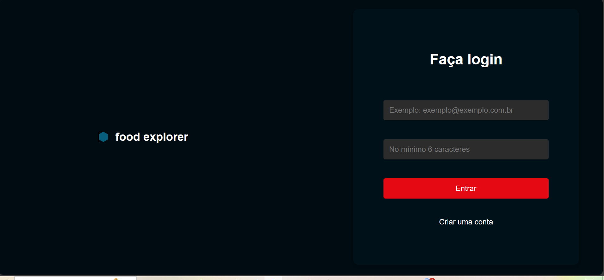
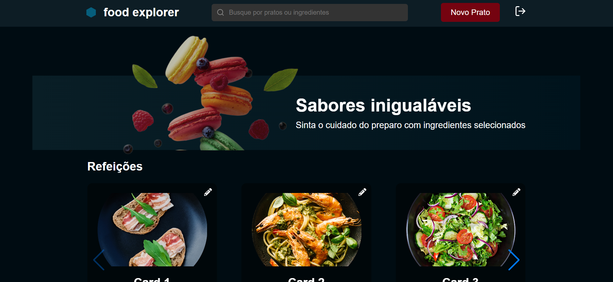
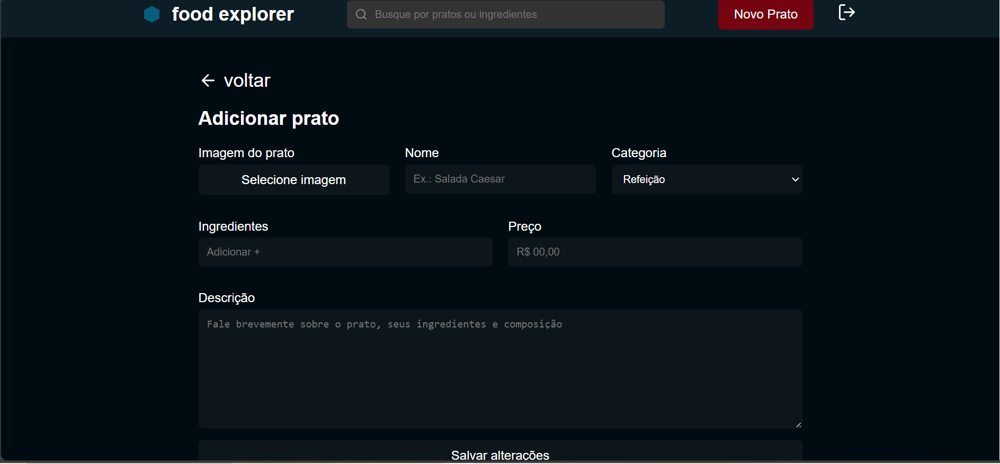

# Food Explorer Front-End

Bem-vindo ao Food Explorer, uma aplicação front-end construída com React que permite aos usuários explorar e gerenciar pratos e ingredientes. Este projeto utiliza autenticação JWT para proteger certas rotas e fornecer uma experiência de usuário segura.

## Visão Geral

O Food Explorer é uma aplicação web que permite aos usuários visualizar, adicionar, editar e excluir pratos e ingredientes. A aplicação utiliza React para a interface de usuário e está integrada com uma API back-end para autenticação e operações de CRUD.

## Previews

### Página de Login


### Página de Cadastro


### Página Principal do Usuário


### Formulário de Adição de Prato


## Instalação

1. Clone o repositório:
   ```sh
   git clone https://github.com/josesousacruz/food-explorer-frontend.git
   cd food-explorer-frontend

2. Instale dependencias
     ````sh
     npm install

## Configuração

1. Criar e configurar o arquivo .env

2. Certifique-se de que a API back-end está rodando e acessível com a URL fornecida.

## Uso
1. Inicie o servidor.
   ```sh
  npm run dev

## Link do Deploy

[Link](https://6670d68ca1ffec736ccd54bc--scintillating-semolina-da59f7.netlify.app/)


